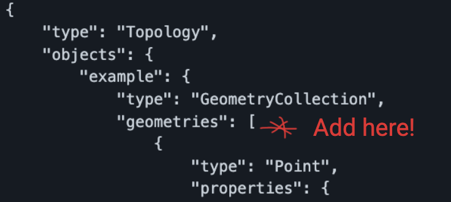

# Where are we?

Here you can see rough locations of cohort 6.

# Rough map of our cohort

```topojson
{
  "type": "Topology",
  "objects": {
    "example": {
      "type": "GeometryCollection",
      "geometries": [
        {
          "type": "Point",
          "properties": {
            "label": "Who",
            "title": "Tinashe"
          },
          "coordinates": [
            -1.53578,
            52.291988
          ]
        },
        {
          "type": "Point",
          "properties": {
            "label": "Who",
            "title": "Alessia/Alli"
          },
          "coordinates": [
            18.0685,
            59.3293
          ]
        },
        {
          "type": "Point",
          "properties": {
            "label": "Who",
            "title": "Neill"
          },
          "coordinates": [
            -2.9335,
            54.895
          ]
        },
        {
          "type": "Point",
          "properties": {
            "label": "Who",
            "title": "Maghfoor"
          },
          "coordinates": [
            -1.12906,
            52.63
          ]
        },
		{
          "type": "Point",
          "properties": {
            "label": "Who",
            "title": "Grace"
          },
          "coordinates": [
            -0.050620
            51.509769
          ]
        },
    }
  }
}
```

## Instructions:

1. Find out your position as longitude, latitude: https://www.latlong.net/ - don't use your exact postcode in case that is too revealing - coordinates of the nearest city or some random place within, say, 20 miles is fine.
1. clone this project from github. Don't fork it! (even though that has advantages, it's not quite as simple).
1. when, and only when, it is your _turn_,
1. make your change (detailed below) as a commit on the main branch directly - (NOTE: this is bad practice on any later week of the course, but a good way to get started)
1. push the main branch up to github
1. check it looks ok when viewed on github!
1. make and push one more change - strike your name out ~~like this~~ from the list below "Who's next to edit?"
1. tell the next person in the list it's their turn!

### The change to make

Add a section to the geometries array in the Rough map of our cohort, higher in this page.

What you add should look something like this object, but adjusted for your name and position.

- Note that the coordinates are given longitude, then latitude.

```
{
    "type": "Point",
    "properties": {
        "label": "Who",
        "title": "Neill"
    },
    "coordinates": [
        -3.3648735,
        56.04
    ]
}
```

### Where to add this object?

Here's roughly where you should add your code, into the geometries array:



- Don't forget to ensure there's a comma between elements of the geometries array (e.g. after your object)

# Who's next to edit?

- ~~Maghfoor~~
- ~~Nico~~
- ~~Tinashe~~
- ~~Alessia~~
- Grace
- Maria
- Zac
- Katrina
- Josiah

# Bonus: How did we get a live diagram/map into a readme file?!

Just for the curious:

[Mapping GeoJSON/TopoJSON files on GitHub](https://docs.github.com/en/repositories/working-with-files/using-files/working-with-non-code-files#mapping-geojsontopojson-files-on-github)
( following the [geoJSON spec](https://www.rfc-editor.org/rfc/rfc7946) )
